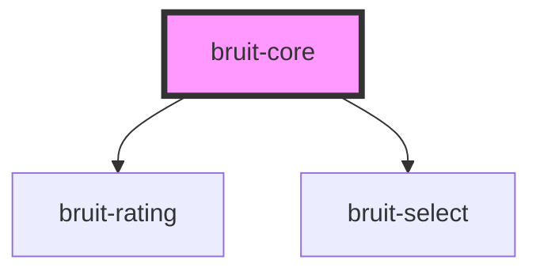

# bruit-core

<!-- Auto Generated Below -->

## Properties

| Property | Attribute    | Description | Type                      | Default     |
| -------- | ------------ | ----------- | ------------------------- | ----------- |
| `config` | `brt-config` |             | `BrtCoreConfig \| string` | `undefined` |

## Events

| Event      | Description                                                                                            | Type               |
| ---------- | ------------------------------------------------------------------------------------------------------ | ------------------ |
| `brtError` | emit bruit-error on internal error or config error ex : BruitIo.addEventListener('onError',error=>...) | `CustomEvent<any>` |

## Methods

### `newFeedback(bruitIoConfig: BruitIoConfig, data?: BrtData[], dataFn?: () => BrtData[] | Promise<BrtData[]>) => Promise<void>`

called on click on component
init a feedback, wait user submit, send feedback

#### Returns

Type: `Promise<void>`

### `sendFeedback(apiKey: any, agreement: any, data: any, dataFn: any) => Promise<any>`

#### Returns

Type: `Promise<any>`

## Dependencies

### Depends on

- [bruit-rating](../bruit-rating)
- [bruit-select](../bruit-select)

### Graph

----------------------------------------------

*Built with [StencilJS](https://stenciljs.com/)*
