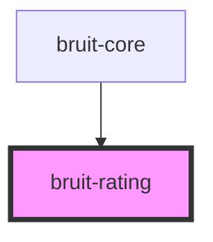

# bruit-rating

<!-- Auto Generated Below -->

## Properties

| Property   | Attribute   | Description | Type     | Default     |
| ---------- | ----------- | ----------- | -------- | ----------- |
| `color`    | `color`     |             | `string` | `'#ffd83d'` |
| `max`      | `max`       |             | `number` | `5`         |
| `offColor` | `off-color` |             | `string` | `'#c0c0c0'` |
| `value`    | `value`     |             | `number` | `0`         |

## Events

| Event         | Description | Type               |
| ------------- | ----------- | ------------------ |
| `valueChange` |             | `CustomEvent<any>` |

## Dependencies

### Used by

 - [bruit-core](../bruit-core)

### Graph

----------------------------------------------

*Built with [StencilJS](https://stenciljs.com/)*
