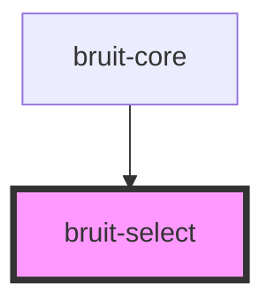

# bruit-select

<!-- Auto Generated Below -->

## Properties

| Property   | Attribute  | Description | Type       | Default     |
| ---------- | ---------- | ----------- | ---------- | ----------- |
| `id`       | `id`       |             | `string`   | `undefined` |
| `options`  | --         |             | `string[]` | `undefined` |
| `required` | `required` |             | `boolean`  | `undefined` |
| `value`    | `value`    |             | `string`   | `undefined` |

## Dependencies

### Used by

 - [bruit-core](../bruit-core)

### Graph

----------------------------------------------

*Built with [StencilJS](https://stenciljs.com/)*
